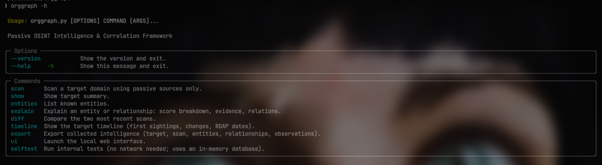
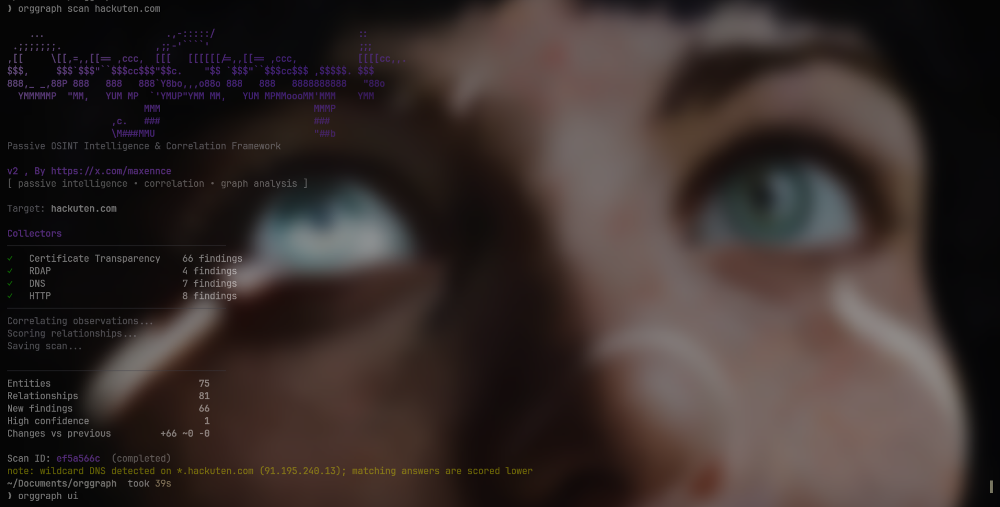
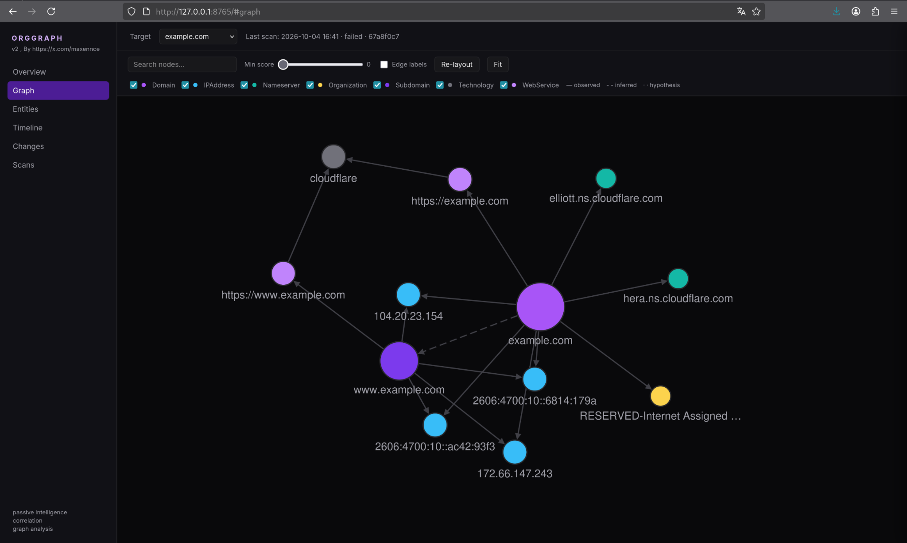
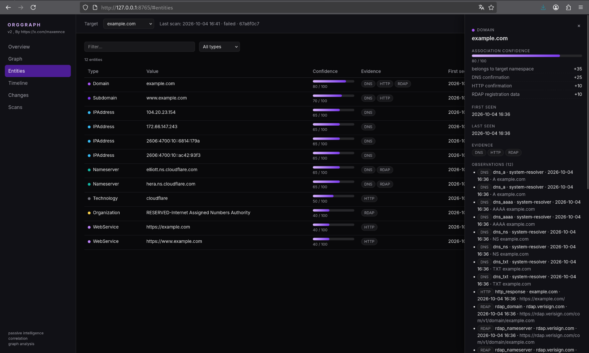

# OrgGraph

**Passive OSINT Intelligence & Correlation Framework**

OrgGraph est un outil OSINT passif qui cartographie l'écosystème public d'une organisation à partir d'un nom de domaine.

Il collecte plusieurs signaux publics, les normalise en entités et relations, puis les corrèle afin de produire une vue structurée et explicable de l'infrastructure observée.

> OrgGraph est conçu pour la recherche OSINT, la veille et la reconnaissance défensive. Il ne réalise pas de brute-force, d'exploitation de vulnérabilités, de contournement d'authentification ou de scan réseau agressif.

---

## Screenshots

### CLI

#### Help

<p align="center">
  
</p>

#### Passive scan

<p align="center">
  
</p>

### Interactive graph

<p align="center">
  
</p>

### Entities & evidence

<p align="center">
  
</p>

---

## Features

- Passive domain reconnaissance
- DNS enumeration
- Certificate Transparency discovery
- RDAP lookup
- Basic HTTP intelligence
- Entity normalization and deduplication
- Relationship correlation
- Explainable confidence scoring
- Scan history
- Diff between scans
- Timeline
- JSON export
- Interactive local web interface
- Graph visualization
- Machine-readable JSON mode
- Collector failures do not stop the whole scan

---

## Data sources

OrgGraph utilise uniquement des informations accessibles publiquement.

### DNS

Records actuellement pris en charge :

```text
A
AAAA
CNAME
MX
NS
TXT
```

### Certificate Transparency

Les certificats publics sont utilisés pour identifier des hostnames et sous-domaines associés à la cible.

Source principale :

```text
crt.sh
```

### RDAP

OrgGraph récupère les informations publiques d'enregistrement disponibles via RDAP.

### HTTP

L'outil peut effectuer une requête HTTP passive sur les hôtes connus afin de récupérer notamment :

```text
HTTP status
page title
Server header
Content-Type
redirects
security headers
```

OrgGraph ne réalise pas de brute-force de chemins ni de crawling massif.

---

## How it works

Chaque information collectée est d'abord enregistrée comme une **observation** avec sa provenance.

Par exemple, `api.example.com` peut être observé indépendamment par :

```text
Certificate Transparency
DNS
HTTP
```

OrgGraph fusionne ensuite les observations correspondant à la même ressource afin de créer une entité unique :

```text
api.example.com

Evidence
├── Certificate Transparency
├── DNS
└── HTTP
```

Les relations entre entités permettent ensuite de reconstruire le graphe :

```text
example.com
     │
     └── HAS_SUBDOMAIN
              │
              ▼
       api.example.com
              │
              └── RESOLVES_TO
                       │
                       ▼
                  IP address
```

---

## Explainable scoring

OrgGraph attribue un score de confiance interne aux entités et relations en fonction des signaux observés.

Exemple :

```text
Association confidence

90 / 100

Evidence

+35 target namespace
+25 DNS confirmation
+20 Certificate Transparency
+10 HTTP confirmation
```

Ce score est **explicable**, mais ne doit pas être interprété comme une probabilité scientifique.

La commande suivante affiche les éléments ayant contribué au score :

```bash
python3 orggraph.py explain ENTITY_ID
```

---

## Installation

### Requirements

- Python 3.10+
- Linux/macOS recommandé

Clonez le dépôt :

```bash
git clone https://github.com/maxennce/orggraph
cd orggraph
```

Créez un environnement virtuel :

```bash
python3 -m venv .venv
source .venv/bin/activate
```

Installez les dépendances :

```bash
python -m pip install -r requirements.txt
```

Lancez les tests internes :

```bash
python orggraph.py selftest
```

Sur Debian/Ubuntu, si `python3 -m venv` échoue :

```bash
sudo apt install python3-venv
```

---

## Usage

### Scan a domain

```bash
python orggraph.py scan example.com
```

### Target summary

```bash
python orggraph.py show example.com
```

### List entities

```bash
python orggraph.py entities example.com
```

### Explain an entity or relationship

```bash
python orggraph.py explain ENTITY_ID
```

### Compare the two latest scans

```bash
python orggraph.py diff example.com
```

### Timeline

```bash
python orggraph.py timeline example.com
```

### Export

```bash
python orggraph.py export example.com
```

### Web UI

```bash
python orggraph.py ui
```

Puis ouvrez :

```text
http://127.0.0.1:8765
```

### Self-test

```bash
python orggraph.py selftest
```

### Help

```bash
python orggraph.py --help
```

---

## Useful options

### Disable the banner

```bash
python orggraph.py scan example.com --no-banner
```

### JSON output

```bash
python orggraph.py scan example.com --json
```

### Verbose mode

```bash
python orggraph.py scan example.com --verbose
```

### Debug mode

```bash
python orggraph.py scan example.com --debug
```

### Select collectors

```bash
python orggraph.py scan example.com --collectors dns,http
```

### Filter entities

```bash
python orggraph.py entities example.com --type Subdomain --min-score 60
```

---

## Scan history

Chaque scan est conservé localement.

En exécutant plusieurs fois :

```bash
python orggraph.py scan example.com
```

OrgGraph peut comparer les observations dans le temps.

```bash
python orggraph.py diff example.com
```

Exemple :

```text
NEW

+ api-v2.example.com


CHANGED

~ api.example.com
  IP changed


NOT OBSERVED

- old-api.example.com
```

`NOT OBSERVED` ne signifie pas forcément que la ressource a été supprimée. Cela signifie uniquement qu'OrgGraph ne l'a pas observée pendant le dernier scan.

---

## Timeline

```bash
python orggraph.py timeline example.com
```

Exemple :

```text
2026-09-01
│
├─ first seen: example.com
├─ first seen: api.example.com
│
2026-09-03
│
├─ api.example.com IP changed
│
2026-09-05
│
└─ first seen: dev.example.com
```

---

## Web interface

OrgGraph inclut une interface web locale accessible avec :

```bash
python orggraph.py ui
```

Adresse par défaut :

```text
http://127.0.0.1:8765
```

L'interface permet notamment d'explorer :

- l'overview de la cible
- les entités
- les relations
- le graphe interactif
- les scans
- la timeline
- les changements
- les preuves et scores

Le graphe utilise Cytoscape.js chargé depuis un CDN.

---

## Local files

OrgGraph crée plusieurs fichiers pendant son fonctionnement :

```text
orggraph.db
config.json
exports/
```

### `orggraph.db`

Base SQLite contenant l'historique des scans, observations, entités et relations.

### `config.json`

Configuration locale : timeouts, concurrence, User-Agent, etc.

### `exports/`

Exports JSON générés par l'outil.

Ces fichiers sont exclus du dépôt Git.

Un exemple de configuration sans secret est fourni :

```text
config.example.json
```

---

## Repository structure

```text
orggraph/
├── .gitignore
├── LICENSE
├── README.md
├── config.example.json
├── orggraph.py
├── pyproject.toml
├── requirements.txt
└── screenshots/
    ├── cli-help.png
    ├── scan.png
    ├── graph.png
    └── entities.png
```

Les fichiers runtime (`orggraph.db`, `config.json`, `exports/`), les environnements virtuels et les artefacts de build ne doivent pas être commités.

---

## Passive by design

OrgGraph n'effectue pas intentionnellement :

- de scan de ports
- d'attaque par identifiants
- de brute-force de mots de passe
- de contournement d'authentification
- d'exploitation de vulnérabilités
- d'énumération agressive d'endpoints
- d'accès à des ressources privées
- de scan réseau intrusif

Si une source échoue ou est rate-limitée, OrgGraph continue avec les autres collecteurs et n'invente pas de résultats.

---

## Limitations

Les données OSINT publiques peuvent être :

- incomplètes
- obsolètes
- temporairement indisponibles
- trompeuses
- liées à une infrastructure mutualisée

Une relation découverte par OrgGraph doit donc être considérée comme un **signal analytique**, et non automatiquement comme une preuve de propriété.

`crt.sh` peut également être lent ou temporairement indisponible.

---

## Responsible use

Utilisez OrgGraph uniquement pour des usages légitimes : OSINT, recherche, sécurité défensive, asset discovery et reconnaissance de systèmes pour lesquels vous disposez des autorisations nécessaires.

L'utilisateur reste responsable du respect des lois applicables, des conditions d'utilisation des services interrogés et des autorisations nécessaires.

---

## Author

Created by **@maxennce**

X / Twitter:

```text
https://x.com/maxennce
```
