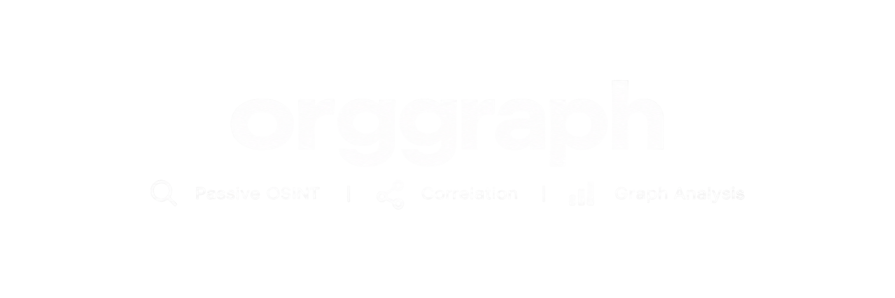

<p align="center">
  
</p>

# OrgGraph

**Framework OSINT passif de collecte, corrélation et visualisation**

OrgGraph est un outil OSINT passif qui cartographie l'écosystème public d'une organisation à partir d'un nom de domaine.

Il collecte plusieurs signaux publics, les normalise en entités et relations, puis les corrèle afin de produire une vue structurée et explicable de l'infrastructure observée.

> OrgGraph est conçu pour la recherche OSINT, la veille et la reconnaissance défensive. Il ne réalise pas de brute-force, d'exploitation de vulnérabilités, de contournement d'authentification ou de scan réseau agressif.

---

## Captures d'écran

### Interface en ligne de commande

#### Aide

<p align="center">
  
</p>

#### Scan passif

<p align="center">
  
</p>

### Graphe interactif

<p align="center">
  
</p>

### Entités et preuves

<p align="center">
  
</p>

---

## Fonctionnalités

- Reconnaissance passive à partir d'un domaine
- Énumération DNS
- Découverte de sous-domaines via les journaux de certificats publics
- Recherche RDAP
- Collecte d'informations HTTP publiques
- Normalisation et déduplication des entités
- Corrélation des relations
- Score de confiance explicable
- Historique des scans
- Comparaison entre plusieurs scans
- Chronologie des changements
- Export JSON
- Interface web locale interactive
- Visualisation sous forme de graphe
- Mode JSON exploitable par des scripts
- Un collecteur en échec ne bloque pas l'ensemble du scan

---

## Sources de données

OrgGraph utilise uniquement des informations accessibles publiquement.

### DNS

Types d'enregistrements actuellement pris en charge :

```text
A
AAAA
CNAME
MX
NS
TXT
```

### Journaux de certificats publics

Les certificats publics sont utilisés pour identifier des noms d'hôtes et des sous-domaines associés à la cible.

Source principale :

```text
crt.sh
```

### RDAP

OrgGraph récupère les informations publiques d'enregistrement disponibles via RDAP.

### HTTP

L'outil peut effectuer une requête HTTP passive sur les hôtes connus afin de récupérer notamment :

```text
code de statut HTTP
titre de la page
en-tête Server
type de contenu
redirections
en-têtes de sécurité
```

OrgGraph ne réalise pas de brute-force de chemins ni de parcours massif de sites.

---

## Fonctionnement

Chaque information collectée est d'abord enregistrée comme une **observation** avec sa provenance.

Par exemple, `api.example.com` peut être observé indépendamment par :

```text
journaux de certificats publics
DNS
HTTP
```

OrgGraph fusionne ensuite les observations correspondant à la même ressource afin de créer une entité unique :

```text
api.example.com

Preuves
├── journaux de certificats publics
├── DNS
└── HTTP
```

Les relations entre les entités permettent ensuite de reconstruire le graphe :

```text
example.com
     │
     └── POSSÈDE_LE_SOUS_DOMAINE
              │
              ▼
       api.example.com
              │
              └── SE_RÉSOUT_VERS
                       │
                       ▼
                  adresse IP
```

---

## Score de confiance explicable

OrgGraph attribue un score de confiance interne aux entités et aux relations en fonction des signaux observés.

Exemple :

```text
Confiance d'association

90 / 100

Preuves

+35 appartient à l'espace de noms de la cible
+25 confirmation DNS
+20 présence dans les journaux de certificats publics
+10 confirmation HTTP
```

Ce score est **explicable**, mais ne doit pas être interprété comme une probabilité scientifique.

La commande suivante permet d'afficher les éléments ayant contribué au score :

```bash
python3 orggraph.py explain ENTITY_ID
```

---

## Installation

### Prérequis

- Python 3.10 ou supérieur
- Linux/macOS recommandé

Clonez le dépôt :

```bash
git clone https://github.com/maxennce/orggraph
cd orggraph
```

Créez un environnement virtuel :

```bash
python3 -m venv .venv
source .venv/bin/activate
```

Installez les dépendances :

```bash
python -m pip install -r requirements.txt
```

Lancez les tests internes :

```bash
python orggraph.py selftest
```

Sur Debian/Ubuntu, si la création de l'environnement virtuel échoue :

```bash
sudo apt install python3-venv
```

---

## Utilisation

### Scanner un domaine

```bash
python orggraph.py scan example.com
```

### Afficher le résumé d'une cible

```bash
python orggraph.py show example.com
```

### Lister les entités

```bash
python orggraph.py entities example.com
```

### Expliquer une entité ou une relation

```bash
python orggraph.py explain ENTITY_ID
```

### Comparer les deux derniers scans

```bash
python orggraph.py diff example.com
```

### Afficher la chronologie

```bash
python orggraph.py timeline example.com
```

### Exporter les résultats

```bash
python orggraph.py export example.com
```

### Lancer l'interface web

```bash
python orggraph.py ui
```

Puis ouvrez :

```text
http://127.0.0.1:8765
```

### Lancer les tests internes

```bash
python orggraph.py selftest
```

### Afficher l'aide

```bash
python orggraph.py --help
```

---

## Options utiles

### Désactiver la bannière

```bash
python orggraph.py scan example.com --no-banner
```

### Sortie JSON

```bash
python orggraph.py scan example.com --json
```

Cette option est notamment utile pour l'intégration dans des scripts.

### Mode verbeux

```bash
python orggraph.py scan example.com --verbose
```

### Mode débogage

```bash
python orggraph.py scan example.com --debug
```

### Sélectionner certains collecteurs

```bash
python orggraph.py scan example.com --collectors dns,http
```

### Filtrer les entités

```bash
python orggraph.py entities example.com --type Subdomain --min-score 60
```

---

## Historique des scans

Chaque scan est conservé localement.

En exécutant plusieurs fois :

```bash
python orggraph.py scan example.com
```

OrgGraph peut comparer les observations dans le temps.

```bash
python orggraph.py diff example.com
```

Exemple :

```text
NOUVEAU

+ api-v2.example.com


MODIFIÉ

~ api.example.com
  adresse IP modifiée


NON OBSERVÉ

- old-api.example.com
```

`NON OBSERVÉ` ne signifie pas forcément que la ressource a été supprimée.

Cela signifie uniquement qu'OrgGraph ne l'a pas observée pendant le dernier scan.

---

## Chronologie

La commande :

```bash
python orggraph.py timeline example.com
```

permet d'afficher l'évolution des observations dans le temps.

Exemple :

```text
2026-09-01
│
├─ première observation : example.com
├─ première observation : api.example.com
│
2026-09-03
│
├─ modification de l'adresse IP de api.example.com
│
2026-09-05
│
└─ première observation : dev.example.com
```

---

## Interface web

OrgGraph inclut une interface web locale accessible avec :

```bash
python orggraph.py ui
```

Adresse par défaut :

```text
http://127.0.0.1:8765
```

L'interface permet notamment d'explorer :

- la vue d'ensemble de la cible
- les entités
- les relations
- le graphe interactif
- les différents scans
- la chronologie
- les changements détectés
- les preuves
- les scores de confiance

Le graphe utilise Cytoscape.js chargé depuis un CDN.

---

## Fichiers locaux

OrgGraph crée plusieurs fichiers pendant son fonctionnement :

```text
orggraph.db
config.json
exports/
```

### `orggraph.db`

Base de données SQLite contenant l'historique des scans, les observations, les entités et les relations.

### `config.json`

Fichier de configuration locale contenant notamment :

```text
délais d'attente
niveau de concurrence
User-Agent
```

### `exports/`

Contient les exports JSON générés par l'outil.

Ces fichiers sont exclus du dépôt Git.

Un exemple de configuration sans secret est fourni :

```text
config.example.json
```

---

## Structure du dépôt

```text
orggraph/
├── .gitignore
├── LICENSE
├── README.md
├── config.example.json
├── orggraph.py
├── pyproject.toml
├── requirements.txt
└── screenshots/
    ├── cli-help.png
    ├── scan.png
    ├── graph.png
    └── entities.png
```

Les fichiers générés pendant l'utilisation (`orggraph.db`, `config.json`, `exports/`), les environnements virtuels et les artefacts de compilation ne doivent pas être ajoutés au dépôt.

---

## Conçu pour rester passif

OrgGraph n'effectue pas intentionnellement :

- de scan de ports
- d'attaque par identifiants
- de brute-force de mots de passe
- de contournement d'authentification
- d'exploitation de vulnérabilités
- d'énumération agressive de points d'accès
- d'accès à des ressources privées
- de scan réseau intrusif

Si une source échoue ou applique une limitation de requêtes, OrgGraph continue avec les autres collecteurs.

L'outil n'invente jamais de résultats lorsqu'une source est indisponible.

---

## Limites

Les données OSINT publiques peuvent être :

- incomplètes
- obsolètes
- temporairement indisponibles
- trompeuses
- liées à une infrastructure mutualisée

Une relation découverte par OrgGraph doit donc être considérée comme un **signal analytique**, et non automatiquement comme une preuve de propriété.

`crt.sh` peut également être lent ou temporairement indisponible.

---

## Utilisation responsable

Utilisez OrgGraph uniquement dans le cadre d'usages légitimes :

- recherche OSINT
- veille
- sécurité défensive
- découverte d'actifs
- analyse d'infrastructures publiques
- reconnaissance de systèmes pour lesquels vous disposez des autorisations nécessaires

L'utilisateur reste responsable du respect des lois applicables, des conditions d'utilisation des services interrogés et des autorisations nécessaires.

---

## Auteur

Créé par **@maxennce**

X / Twitter :

```text
https://x.com/maxennce
```
